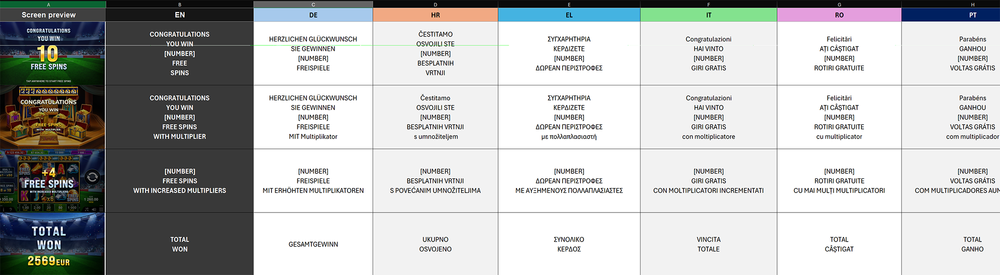

# Prevoda4ka


## What Is This?

**Prevoda4ka** is an **Adobe Photoshop UXP plugin** that automates the translation of text inside **Smart Objects and plain text layers** in PSD/PSB files using a pre-prepared Excel translation table.

---

## Tech Stack

| Layer | Technology |
|---|---|
| Boilerplate | Bolt UXP: https://hyperbrew.co/resources/bolt-uxp |
| Runtime | Adobe UXP (Unified Extensibility Platform) inside Photoshop |
| Framework | React 19 (JSX) |
| Build Tool | Vite 6 + `vite-uxp-plugin` |
| Package Manager | npm |
| Excel Parsing | SheetJS (`xlsx.full.min.js`) bundled as a UMD lib in `/src/lib/` |
| Photoshop API | `photoshop` UXP module (batchPlay, executeAsModal, app) |
| PSD Binary Parsing | Custom binary parser (`psdParser.js`, `validateMasterFile.js`) for nested SO detection, font extraction, and linked layer scanning — reads raw PSD/PSB bytes without Photoshop API |
| Filesystem API | `uxp.storage.localFileSystem` |
| Styling | CSS + CSS variables for UXP theming |

**Dev commands:**
- `npm run dev` — watch build (for live plugin reloading in PS)
- `npm run build` — production build
- `npm run ccx` — package as `.ccx` for distribution

---

## Project Structure

```
Prevoda4ka/
├── src/
│   ├── index.jsx              # UXP entry point
│   ├── main.jsx               # Root App component — all state lives here
│   ├── globals.js             # Safe require() shims for uxp + photoshop modules
│   ├── api/
│   │   ├── api.js                   # Unified API object exported to components
│   │   ├── photoshop.js             # All PS-specific functions (translateSmartObject, recursive SO translation, font replacement, canvas cropping, etc.)
│   │   ├── excelParser.js           # Excel file parsing — file/ArrayBuffer in → { languageData, availableLanguages } out
│   │   ├── parsingLogic.js          # translateAll, processMatchedFolder, matchLayersToLines, parseRawPhrase, buildDoNotTranslateSet
│   │   ├── phraseGuesser.js         # guessThePhrase — walks layer ancestry to find EN phrase + translation
│   │   ├── getTranslatableLayers.js # Returns SO/text child layers for a folder, filtered and deduped
│   │   ├── validateMasterFile.js    # Binary PSD analysis: nested SO detection, font scanning (main doc + inside SOs), missing link detection, naming quality scoring
│   │   ├── fontManager.js           # Font replacement engine: getAllFonts, setSubstituteFont, changeFont (missing font remap + installed font swap)
│   │   ├── psdParser.js             # Low-level PSD/PSB binary parser (layer records, additional info blocks, UUID extraction)
│   │   ├── uxp.js                   # UXP filesystem helpers, plugin info, color scheme
│   │   └── utils/                   # Shared utility helpers
│   ├── components/
│   │   ├── LoadFDiskButton.jsx           # Load Excel from disk via file picker
│   │   ├── LoadFURLButton.jsx            # Load Excel from URL (disabled)
│   │   ├── LanguageSelectorDropdown.jsx  # Dropdown to pick target language
│   │   ├── FontSelectorDropdown.jsx      # Dropdown to pick substitute font for missing fonts
│   │   ├── DataStatusIcon.jsx            # Visual indicator: data loaded or not (earth icon)
│   │   ├── TranslateAllButton.jsx        # Triggers translateAll() for entire document
│   │   ├── TranslateSelectedButton.jsx   # Triggers translateSelected() for active layer
│   │   ├── TranslateSelectedTextField.jsx# Manual translation input field
│   │   ├── GenerateSuggestionsButton.jsx # Triggers suggestion generation for selected layer
│   │   ├── GuessThePhrase.jsx            # Debug UI for testing phraseGuesser on selected layer
│   │   ├── SuggestionsContainer.jsx      # Scrollable list of translation suggestions
│   │   ├── TranslateSuggestion.jsx       # Individual suggestion item (selectable)
│   │   ├── PhraseReference.jsx           # Shows original EN phrase for reference
│   │   ├── ValidateMFButton.jsx          # UI trigger for document validation
│   │   ├── validationWindow.jsx          # Modal dialog displaying the validation report
│   │   └── ResetButton.jsx              # Reloads the plugin (full state reset)
│   ├── assets/
│   │   └── icons/                        # Plugin icons (light/dark theme, active/inactive states)
│   └── lib/
│       └── xlsx.full.min.js              # Bundled SheetJS (accessed via window.XLSX)
├── public/
│   └── icons/                 # Plugin panel icons (dark@1x/2x, light@1x/2x) — copied to dist/ by Vite
├── uxp.config.js              # Plugin manifest config
├── vite.config.js             # Build config
└── package.json
```

---

## State Management

All state lives in `main.jsx` (App component). **No external state library** — plain React `useState`.

| State | Type | Purpose |
|---|---|---|
| `languageData` | `Object` | Keys = language codes (EN, DE, BG...), values = arrays of translation strings |
| `availableLanguages` | `Array<string>` | Language codes parsed from Excel header row |
| `selectedLanguage` | `string` | Currently selected target language |
| `isDataLoaded` | `boolean` | Whether Excel was successfully parsed |
| `availableFonts` | `Array<string>` | All installed font names (populated at Excel load time) |
| `selectedFont` | `string` | Currently selected substitute font |
| `suggestions` | `Array<{id, text, placeholder}>` | Translation suggestions for the selected layer |
| `selectedId` | `number\|null` | Currently selected suggestion ID |
| `isProcessing` | `boolean` | Guards async operations |
| `textfieldValue` | `string` | Manual translation input value |

The `appState` object bundles relevant state into a single prop passed down to components/functions that need context.

---

## UI Workflow

The plugin UI is organized into three steps:

**STEP 1 — Load & Configure:**
- Load Excel translation file (from disk or URL)
- Select target language from dropdown
- Optionally select a substitute font (for documents with missing fonts)
- Validate the document (opens a report dialog)
- Reset button reloads the plugin

**STEP 2 — Translate All:**
- Translates all matching Smart Objects and text layers in the document
- Performs pre-flight guards: document format (PSD/PSB only), structure (must have both SOs and groups), language selection, and loaded data

**OPTIONAL — Manual Translation:**
- Generate translation suggestions for a selected layer
- Select from suggestions or type manual translation
- Translate individual selected layer

---

## Excel Translation File Format

The Excel file has this structure:



- Row 0 = language codes (column headers). Special columns like `Screen Preview` are ignored.
- Row 1+ = translation pairs. EN column is the lookup key; other columns are translations.
- `languageData["EN"][i]` corresponds to `languageData["DE"][i]` — **index-aligned arrays**.
- Multi-word phrases appear as a single cell. Multi-line phrases (e.g. `FREE\nSPINS`) are split and individual lines matched separately.

---

## Sample Translation Data

> The following is a sample of the actual translation table, converted from the original `.xlsx` file. It illustrates the real structure, content, and edge cases the plugin must handle — including multiline phrases, `[NUMBER]` placeholders, `(do not translate)` markers, missing cells, and entries that only cover a subset of languages.

```csv
Screen preview,EN,DE,HR,EL,IT,RO,PT,ES,MK,SQ,SR,UK,RU,TR,HU,CS,PT-BR,NL,DA,FR,PL,ZH-CN,SK,SL,SV,ET,KO,KA,LV,LT,,,
,"CONGRATULATIONS
YOU WIN
[NUMBER]
FREE SPINS","HERZLICHEN GLÜCKWUNSCH
SIE GEWINNEN
[NUMBER]
FREISPIELE",...
,"+ [NUMBER]
FREE SPINS
WITH INCREASED MULTIPLIERS","+ [NUMBER]
FREISPIELE
MIT ERHÖHTEN MULTIPLIKATOREN",...
,"TOTAL
WON",GESAMTGEWINN,...
,"TOTAL
CREDITS
WON","GESAMTZAHL 
GEWONNER CREDITS",...
,"FREE SPINS

[NUMBER]  OF [NUMBER]  ","FREISPIELE

[NUMBER] VON [NUMBER]",...
,"SUPER (do not translate!)
FREE SPINS
[NUMBER]  OF [NUMBER] ","SUPER
FREISPIELE
(value) VON (value)",...
,MULTIPLIERS,MULTIPLIKATOREN,...
,BUY BONUS,"BONUS 
KAUFEN",...
,ACTIVE,AKTIV,...
,RESPIN,Neudreh,...
,YOU WIN,SIE GEWINNEN,...
,WIN,GEWINN,...
,COLLECTED,EINGESAMMELT,...
,BACK IN THE GAME,ZURÜCK IM SPIEL,...
,1 free respin,1 kostenloser Neudreh,...
,SELECT FREE SPINS,Freispiele auswählen,...
,0 SPINS REMAINING,0 VERBLEIBENDE DREHS,...
,SPINS COMPLETED,ABGESCHLOSSENE DREHS,...
```

---

## PSD Naming Convention

The plugin relies on layer names inside the PSD to match against the EN phrase table. Correct naming is the foundation of automatic translation.

### Smart Object Naming

Smart Object (SO) names must match the **individual words/lines** of an EN phrase from the Excel table. The plugin collects all SO and text layer names within a folder, combines them into a compound, and scores it against EN phrases.

**Example — phrase `"FREE\nSPINS"` (two lines in Excel):**

The containing folder should have two SOs (or text layers) named:
```
📁 freeSpinsContainer/
  🔲 FREE          ← SO or text layer, name = first line of EN phrase
  🔲 SPINS         ← SO or text layer, name = second line of EN phrase
```

**Multi-line phrases** are split by newline. Each line becomes an independent layer name to match:
```
EN cell: "CONGRATULATIONS\nYOU WIN\n[NUMBER]\nFREE SPINS"

📁 congratulationsGroup/
  🔲 CONGRATULATIONS
  🔲 YOU WIN
  🔲 [NUMBER]         ← placeholder — kept as-is or skipped via do-not-translate
  🔲 FREE SPINS
```

**Naming rules:**
- Names are **case-insensitive** — `free`, `FREE`, `Free` all match
- **"Copy N" suffixes** are stripped before matching — `"Free copy 3"` → `"Free"`
- **Short/noise names** with zero word overlap with any EN phrase (e.g. `"Base"`, `"off"`) are filtered out
- SO names should match EN phrase lines **exactly** (after normalization). Partial matches fall back to fuzzy scoring

### Indexing / Layer Order

When multiple layers match the same EN phrase, they are assigned translated lines **sequentially by position in the layer stack** (top to bottom in Photoshop = first to last in the layers array):

```
EN phrase: "BUY\nBONUS"
DE translation: "BONUS\nKAUFEN"

📁 buyBonusGroup/
  🔲 BUY     ← matched to EN line 0 → gets DE line 0 = "BONUS"
  🔲 BONUS   ← matched to EN line 1 → gets DE line 1 = "KAUFEN"
```

The matching pipeline (`matchLayersToLines`) uses a confidence ladder:
1. **Exact match** — layer name equals an EN line exactly
2. **Fuzzy match** — layer name starts with an EN line (prefix)
3. **Word-in-line** — layer name appears as a word within an EN line
4. **Stack index fallback** — layer's position in the stack determines assignment

The last matched layer absorbs any remaining translation lines (handles translator expansion where one EN line becomes multiple translated lines). Layers beyond the available translation slots get `null` (left untouched).

### Bracket Rules in EN Phrases

**`()` — Do-Not-Translate markers.** When an **entire** EN line is wrapped in parentheses (e.g. `(SUPER)`), the layer **is matched** and **consumes a positional slot**, but is **not translated** — it keeps its original text. The parentheses are stripped for layer-name matching (`(SUPER)` → `SUPER`).

**`[]` — Dismissed entirely.** Square-bracket placeholders like `[Number]` or `[Multiplier]` are stripped and **do not count as a line**. They consume no slot and produce no layer match.

```
EN phrase: "(X2)\nCHANCE\nFOR BONUS\n[Number]"

After parsing:
  Slot 0: X2         ← from (X2), matched to layer but NOT translated
  Slot 1: CHANCE     ← translated
  Slot 2: FOR BONUS  ← translated
  [Number]           ← stripped, not a slot, no layer match
```

`buildDoNotTranslateSet(rawEnPhrase)` extracts the `()` markers. Skipped layers still consume their positional slot so subsequent layers receive the correct translation line. Square-bracket stripping happens in `getTranslatableLayers` and `parseRawPhrase`.

### Folder / Group Names

- **Folder names are transparent** — they are not used for matching. CamelCase scene names like `doubleChanceOffLandscape`, `buyBonusBtnActive1Portrait` do not interfere.
- **Language code groups** (`EN`, `DE`, `HR`, `BG`, etc.) are treated as noise and ignored.
- **Generic wrapper groups** (`Group 1`, `Group 2`, etc.) are ignored.
- **Structural names** (`SLICES`, `BACKGROUND`, `BG`) are ignored.

### Target Layer Types

The plugin handles **both**:
- **Smart Objects** (`SMARTOBJECT`) — translated by entering edit mode, finding text layers inside, setting text, then saving and closing
- **Plain text layers** (`TEXT`) — translated directly via `textItem.contents`

All other layer types (shapes, fills, adjustments, masks) are excluded at the `getTranslatableLayers` stage.

---

## How the Plugin Works

### Translate All

The main translation button. Translates every matching Smart Object and text layer in the entire document in one pass.

**Before it starts, the plugin runs these checks (in order):**
1. **Format check** — the active document must be a `.psd` or `.psb` file. Any other format (TIFF, PNG, etc.) is rejected with an alert.
2. **Structure check** — the document must contain both Smart Objects and groups among its visible layers. If either is missing, it's not a valid master file for translation.
3. **Language check** — a target language must be selected from the dropdown.
4. **Data check** — the Excel translation file must be loaded.

If all checks pass, translation proceeds:

1. The plugin collects all visible layers in the document and filters down to Smart Objects only. If the same SO appears multiple times (linked instances), only one copy is kept — translating one instance automatically updates all others.

2. For each unique SO, the plugin walks up its layer hierarchy to find the **phrase container** — the highest parent folder whose children (SO and text layer names) are fully explained by a single EN phrase from the Excel table. This determines which EN phrase and which translated phrase apply.

3. Inside the matched folder, the plugin collects all translatable children (SOs and text layers), then matches each one to a line from the translated phrase. Matching works on a confidence ladder:
   - **Exact** — layer name equals an EN line exactly (e.g. layer `FREE SPINS` matches EN line `FREE SPINS`)
   - **Fuzzy** — layer name starts with an EN line (e.g. `CREDITS copy 2` matches `CREDITS`)
   - **Word-in-line** — layer name appears as a word within a multi-word EN line (e.g. `FREE` matches inside `FREE SPINS`)
   - **Stack index fallback** — if the name doesn't match anything, the layer's position in the stack determines which translation line it gets

   If too many layers fall through to stack-index matching (confidence below 50%), the entire folder is skipped to avoid misassignment.

4. Each matched layer receives its translated text. Smart Objects are opened, edited, and saved back. Text layers are updated directly. See **Recursive Smart Object Translation** and **Font Replacement** below for details on how SOs are handled.

5. After a folder is processed, all SO IDs within it are marked as "done". If the same SO appears again in another folder or as a nested instance, it is skipped — no duplicate work.

### Translate Selected

Translates a single manually selected layer. Use this for one-off corrections or when you want to override the automatic translation for a specific layer.

**How to use:**
1. Select exactly one layer in Photoshop (must be a Smart Object or text layer)
2. Either type your translation in the text field, or use **Generate Suggestion** to get one
3. Click **Translate Selected**

The plugin will alert you if:
- No layer or more than one layer is selected
- The selected layer is not a Smart Object or text layer
- The text field is empty

### Generate Suggestion

Finds the correct translation for the currently selected layer based on the Excel data.

**How it works:**
1. The plugin looks at the selected layer and walks up its parent folders to find which EN phrase it belongs to (same logic as Translate All)
2. It finds the matching translated phrase for the selected language
3. It returns the relevant portion of the translation as a suggestion (or multiple suggestions if the phrase has several lines)

The suggestions appear in a scrollable list — click one to fill the text field, then use **Translate Selected** to apply it.

If the plugin can't find a matching phrase for the selected layer (e.g. the layer isn't named according to the naming convention, or its parent folder doesn't correspond to any EN phrase), it shows an alert.

### Recursive Smart Object Translation

Smart Objects in the master files often contain **other Smart Objects inside them** (nested SOs). For example, a "FREE SPINS" SO might contain a text layer for the words and another nested SO for a decorative element with its own text.

The plugin handles this automatically with **depth-first recursive translation**:

1. Open the top-level SO
2. Replace fonts if a substitute font is selected (see **Font Replacement** below)
3. Translate all visible text layers inside
4. Check if there are any nested SOs inside — if yes, open each one and repeat from step 2
5. After the deepest level is fully translated, crop the SO canvas to fit the new text, save, and close
6. Work back up, saving and closing each level

This means a single "Translate All" click handles arbitrarily deep nesting — SOs inside SOs inside SOs are all translated in one pass.

**Canvas cropping:** after translating text inside an SO, the plugin resizes the SO's internal canvas to tightly fit the translated content. This prevents the SO from visually overflowing or leaving large empty gaps in the parent document. Cropping only runs at the outermost SO level.

**Safety guard:** if a Smart Object contains an unusually large number of layers, the plugin skips it to prevent Photoshop from freezing on overly complex structures.

### Font Replacement

When the master PSD was built on a different machine, the fonts used in text layers may not be installed on your system. Photoshop marks these as "missing fonts" and refuses to properly edit them. The plugin solves this with a two-phase font replacement that runs automatically inside each SO during translation (only when you've selected a substitute font from the dropdown).

**Phase 1 — Missing fonts:**
All missing fonts in the document are replaced at once with the selected substitute. This is the only reliable way to fix missing fonts in Photoshop — editing individual layers won't work because Photoshop refuses to apply any changes to text with a missing font.

**Phase 2 — Installed but wrong fonts:**
After fixing missing fonts, any text layers that have an installed font (but not the substitute font) are updated individually. The plugin carefully preserves all text formatting (size, color, paragraph style, etc.) and only swaps the font name.

**Why the order matters:**
Photoshop has a known bug: if you change the text content of a layer that just had its missing font fixed, the font fix gets destroyed — the text reverts to the missing font state. To avoid this, when a layer had a missing font, the plugin writes the new text and the font in a single atomic operation instead of two separate steps. This is why font replacement always runs **before** text translation inside each SO.

**Font size preservation:**
Photoshop has another quirk: changing text content via the standard API resets the visual font size. After every text change, the plugin restores the original font size to keep the layout intact.

---

## Document Validation

The **Validate Doc** button runs a comprehensive pre-translation analysis and shows the results in a popup dialog. Use it before translating to catch potential problems.

The validation reads the PSD file both through Photoshop's API and by parsing the raw file bytes directly (which reveals information the API cannot access, like what's inside embedded Smart Objects).

### What it checks:

**1. Nested Smart Objects**
Scans the PSD binary to find Smart Objects that contain other Smart Objects inside them. These are reported with their names and count. Nested SOs are supported by the recursive translation, but extreme nesting depth or very complex structures may cause slowdowns.

**2. Missing Fonts**
Checks for fonts that are used in text layers but not installed on your system. This check covers:
- **Text layers in the main document** — reads each text layer's font settings
- **Text layers inside Smart Objects** — parses the raw binary data of each embedded SO to extract font names from within

All missing fonts are reported with the layer names that use them. If you see missing fonts, select a substitute font from the dropdown before translating.

**3. Missing Links**
Checks for Smart Objects whose linked source files cannot be found. This happens when:
- **Top-level SOs** — the linked file was moved or deleted
- **Nested SOs** — SOs inside other SOs often reference files by absolute paths from the machine where the PSD was created. These almost always show as "missing" on a different machine

Missing links are reported with count and layer names. Missing top-level links may prevent those SOs from being translated.

**4. Naming Quality Score**
Only available when Excel data is loaded. Evaluates how well the PSD's layer names align with the EN phrases in the Excel table.

Every layer name is classified as:
- **Phrase** — matches a word from the EN translation table (good — these layers will be found during translation)
- **Structural** — matches known structural names like `BACKGROUND`, `SLICES`, or scene container names (neutral — these are expected non-translatable layers)
- **Noise** — doesn't match anything (potential problem — these layers won't be matched during translation)

The result is a score from 0 to 100. Smart Object names are weighted most heavily (50%) since they're the primary translation targets. A high score means the PSD is well-prepared for translation; a low score suggests layer names may need cleanup in the PSD.


## Known Issues / WIP Areas

- `LoadFURLButton` is disabled (URL hardcoded to `null`)
- Font shrink bug: workaround in `translateSmartObject` restores `impliedFontSize` via batchPlay after setting `textItem.contents`
- Some diagnostic `console.log` calls remain, marked `// DELETE LATER`
- `validateMasterFile.js` contains `KNOWN_STRUCTURAL_NAMES` — a hardcoded set of known PSD structural/scene names used for naming quality scoring. Should be made configurable or derived from the document.

---


